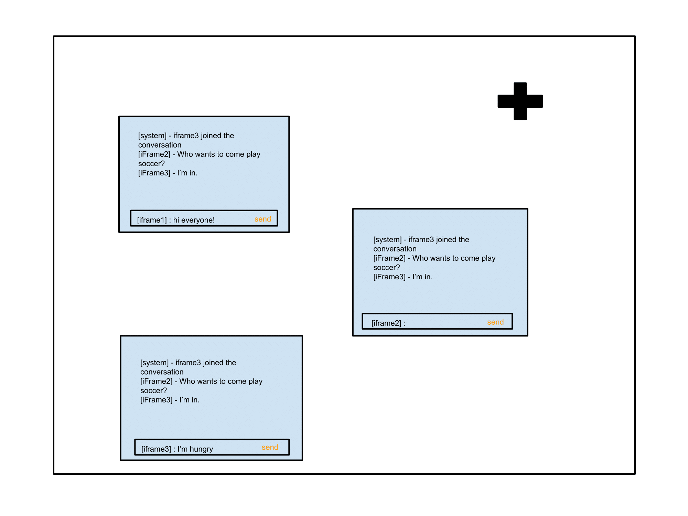

# Dynamic Yield: Customer Success Engineer Technical Challenge

A simple chat client using JavaScript and inter-iframe communication that is built in Web APIs, CSS and HTML to meet the needs of a client

## Quick Start

1. Clone this repo using `git clone https://github.com/Junjie-Chen/dynamic-yield-customer-success-engineer-technical-challenge.git`.
2. Install a command line executable `code` from within Visual Studio Code by opening the Command Palette (`⌘⇧P`), typing `shell command` to find the option `Shell Command: Install 'code' command in PATH`, and selecting that option, then restarting your terminal.
3. Install a `Live Server` extension from within Visual Studio Code by opening and searching it on the Extensions Marketplace (`⌘⇧X`or the `square icon` in the left sidebar).
4. Move into the root directory: `cd dynamic-yield-customer-success-engineer-technical-challenge`.
5. Open the repository with `code .`.
6. Press `control + click` or right click `Open with Live Server [⌘L O]` in top-level `index.html` to see the application at `http://127.0.0.1:5500`.

## Deployment

Click [here](https://chat-client-at-dynamic-yield.herokuapp.com/) to see the deployed application on [Heroku](https://devcenter.heroku.com/articles/git).
* `composer.json` and `index.php` are created for deploying a static website to Heroku.

## Requirement

A Customer Success Engineer will be asked to work on custom projects from existing clients of Dynamic Yield and the company believe the scenario below is indicative of what the Engineer will be asked to do.

### Main Features

* There is no server code on this project, just client. Basically, you can put everything in a directory that will include the "site" + assets you'll build and open it locally in the browser.
* When a user opens the "site" all there is - is a "+" button. Every click on the "+" button adds an iframe to the page. This iframe is a chat client with the other iframes. Every iframe has a line you can write text in and press "send" to post. this post in shown on all iframes - like a chat room.
* All the iframes should communicate with the parent frame using postMessage. iframes should not communicate directly between them.

### Extra Features

- Make it look nice.
- iFrame windows should be draggable on the screen.

### Wireframe

## Development

Utilize `Window.postMessage()` method to safely enable cross-origin communication between Window objects; e.g., between a page and a pop-up that it spawned, or between a page and an iframe embedded within it. `Window.postMessage()` provides a controlled mechanism to securely circumvent the "same-origin policy" (if used properly).

## Design

Use custom CSS including Flexbox to craft an appealing and user-friendly UI/UX for standard and popular devices of different sizes.

## Technical Challenges

- [x] Store all created iframes in an object literal `iframes` with the key as the value of their name attribute and the value as the iframe element for access and retrieval later.
- [x] Reference the name attraibute on each iframe with `Window.frameElement.name` or `Window.frames.name` as a unique identifier.
- [x] Broadcast a message to other users by finding all recipients that excludes the sender in the `iframes` object.
- [x] Store the name attribute of each iframe in an array `user`to allow the system notification of a joined user at their first time.
- [x] Append and post the message only if the user typed a message whose length is greater than the one of `Window.frameElement.name` or `Window.frames.name` in the input field.
- [x] Create an event constrcutor to avoid repeating `EventTarget.addEventListener()`.
- [ ] If the application is opened in the file system (`file://`) on Chrome, there is a known cross-origin error - `Blocked a frame with origin "null" from accessing a cross-origin frame.` - popped up in the console even though the targetOrigin of `Window.postMessage()` is set to be `"*"` (`Lastly, posting a message to a page at a file: URL currently requires that the targetOrigin argument be "*".` according to MDN. However, it still fails to communicate with `Window.parent`). Google blocks it from third-party malicious attack for security concerns. Two-way iframe communication works well when the application is served by a local web server.
- [ ] Calculate the final position of an iframe by subtracting the horizontal and vertical coordinates of a mouse cursor with mouse events of `mousedown`, `mousemove` and `mouseup` on `HTMLIFrameElement.contentWindow` from the `HTMLElement.offsetTop` and `HTMLElement.offsetLeft` property of an iframe element. The first iframe is draggable to some extent, but others need to be fine-tuned for their final position. Uncomment `line 26` in top-level `main.js` to see the draggable effect.

## Conclusion

I enjoy addressing the technical challenges as progressing in the project to meet the needs of a client. I am glad to learn and implement a new way of client-side communication besides real-time bidirectional event-based `Socket.io`. Clarifying some requirement is beneficial to delivering the completed project in a highly qualitative and timely manner.
